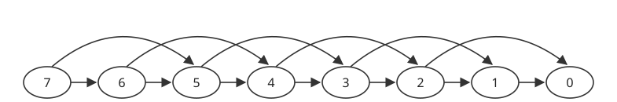
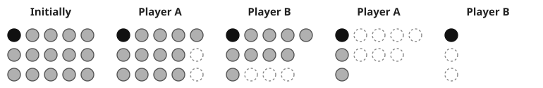

# Combinatorial Game Theory

## 1 Introduction

Let's play a game. Imagine that the two of us take a bunch of fruit from the dining hall – say 1
apple, 2 bananas, 3 oranges, 4 pears, and 5 mangoes – and we sort them by the kind of fruit they
are. We take turns eating the fruit. One your turn, you can select one type of fruit, and eat as
many of it as you want (but you need to eat at least one). On my turn, I do the same thing. The
person who eats the last piece of fruit wins. This is an example of a game of **Nim**.

Okay, now stop imagining and actually play the game with someone! You'll find that it is very
different from the usual "games" that we play, such as poker or chess. Why is that? In the game of
Nim, there is absolutely no luck involved. This separates it from blackjack and poker and go fish.
Also, both players of Nim have complete information about the situation of the game: nothing is
hidden. Games where everyone has perfect information and that involve no chance are called
**combinatorial games**. For the idea of perfect information to work, we need to restrict
ourselves to games in which the players take turns making moves.

Examples of combinatorial games include chess, tic-tac-toe, Connect 4, and go. Since these games
have no chance, there do exist strategies for "perfect play." After a few games of tic-tac-toe, we
can convince ourselves that when both players play optimally, neither player will win. Thus, we
consider tic-tac-toe a **solved** game. Connect 4 has been solved as well, but with significant
help from computers. Chess and go are so complex that we still do not know what the best
strategies are. (This might be a good thing, because it is what makes them fun!)

However, there is still something that sets Nim apart. Unlike the others, in Nim, both players are
allowed the exact same set of moves. (Compare this to chess: you are not allowed to move your
opponent's pieces around the board!) When players are restricted to the same set of moves, we have
an **impartial game**.

## 2 The Subtraction Game

To help us understand the nature of impartial games, let's take an example simpler than Nim, called
the **Subtraction Game**. Imagine that we have all the fruit again. This time, however, we do not
distinguish between the different kinds. On each turn, you can choose to eat one or two pieces of
fruit. We take turns doing this, and, like last time, the person who eats the last piece wins.

This is a variant of the Subtraction Game, where the available moves are elements of the set
$$S = \{1, 2\}$$, meaning that we can either remove 1 or 2 each turn.

It is easy to analyze this game. We can represent it as a **directed graph**, in which the possible
positions are the vertices, and the possible moves between positions are the directed edges. For
our subtraction game, we have the following graph:

{: width="100%"}

To win the game, you have to be the one that moves to the 0 vertex. What happens if you move to 1?
If you do that, the opponent can move to 0. So moving to 1 is not a good idea. Is it a good idea to
move to 2? No, for the same reason.

What about 3? It seems pretty safe. In fact, it is better than safe. If you can move to 3, then
your opponent must move to 1 or 2, and you can win right afterwards! (We had just established that
1 and 2 are both unsafe positions.)

Continuing this reasoning, we see that 4 and 5 are unsafe to move to, while 6 is safe. In general,
we can see that the safe positions to move to are those which are divisible by 3.

## 3 P-positions and N-positions

### 3.1 Definitions

Before we move on, we should introduce some terms so that we can be precise. Earlier, we were using
"safe" when we really meant "safe to move *to*" (as opposed to "safe to move *from*"). To avoid
this ambiguity, we will use the following instead of "safe" and "unsafe."

1. A **P-position** is a position that is good to move to. At this point, the **p**revious player
	can win by playing optimally.
2. An **N-position** is a position that is bad to move to. If you move here, the **n**ext person to
	play can win by playing optimally.

Going back to our subtraction game, we see that the P-positions consist of all the positions which
are divisible by 3, and the rest are N-positions. There's nothing new here, except for the new
terms.

### 3.2 Criteria {#criteria}

To solve an impartial game, we have to identify the P-positions and the N-positions. The following
properties need to be satisfied:

1. Every possible position is either a P-position or an N-position (but not both).
2. From every N-position, it is possible to move to a P-position.
3. From any P-position, it is not possible to move to another P-position.
4. The ending position is a P-position.

Once we have correctly identified the P-positions and N-positions, we take the following as our
strategy: On our turn, we move to a P-position. The the opponent has no choice but to move to an
N-position. But then we can move to another P-position, and so on.

Of course, this only works if we start by moving from an N-position. If we start from a P-position,
then the opponent can use that strategy and we would not be able to do anything! (If the starting
position of a game is a P-position, you should say that you are being nice, and then offer to let
your opponent make the first move!)

## 4 Back to Nim

First, we'll refer to a position in Nim as an unordered $$n$$-tuple. For example, the initial
position we introduced (1 apple, 2 bananas, 3 oranges, 4 pears, and 5 mangoes) can be represented
as $$(1, 2, 3, 4, 5)$$.

Let's see if we can identify the N and P-positions for this game. Just like the Subtraction Game,
we can work backwards from the ending positions.

### 4.1 The simplest cases

The ending position is when there are no piles left, so we can represent it by the 0-tuple
$$()$$. This has to be a P-position.

Anything that moves to $$()$$ must be an N-position. What are all of these? They are precisely the
positions with 1 nonempty pile, since the next player can just remove everything from that pile.
So now, we have:

- P-positions: $$()$$
- N-positions: $$(a)$$

(We'll assume that all piles are nonempty, so that all variables are positive integers.)

We can move on to positions involving two piles. The simplest one is $$(1, 1)$$. Clearly the moves
are forced. The game must proceed as follows:

$$(1, 1) \longrightarrow (1) \longrightarrow ()$$

The first player will move to $$(1)$$ and the second will move to $$()$$ and win. Thus
$$(1, 1)$$ is a P-position. Another way of thinking about this is that from $$(1, 1)$$, we cannot
find a move to another P-position.

Then, it follows that any position of the form $$(1, a)$$ with $$a \geq 2$$ is an N-position. The
next player can move to $$(1, 1)$$ and win.

We can see that when there are two piles, the P-positions are the ones for which the two piles have
equal size. If the other player moves from this position by removing $$k$$ from one pile, you can
remove $$k$$ from the other so that the two piles always have the same size after your move.

So now, we have:

- P-positions: $$()$$; $$(a, a)$$
- N-positions: $$(a)$$; $$(a, b)$$ with $$a \neq b$$

### 4.2 Positions with 3 piles

We can move on to positions containing three piles. Now it is not so easy. Let's start with piles
where the smallest pile contains one. Using our current list of P and N positions, we see that the
following are P-positions:

$$(1, 2, 3)$$; $$(1, 4, 5)$$; $$(1, 6, 7)$$; $$(1, 8, 9)$$; $$(1, 10, 11)$$; $$(1, 12, 13)$$; ...

Similarly, we can move on to piles where the smallest pile has number $$s$$:

| $$s$$ | P-positions |
| :---: | --- |
| 1 | (1, 2, 3); (1, 4, 5); (1, 6, 7); (1, 8, 9); (1, 10, 11); (1, 12, 13); ... |
| 2 | (2, 4, 6); (2, 5, 7); (2, 8, 10); (2, 9, 11); (2, 12, 14); (2, 13, 15); ... |
| 3 | (3, 4, 7); (3, 5, 6); (3, 8, 11); (3, 9, 10); (3, 12, 15); (3, 13, 14); ... |
| 4 | (4, 8, 12); (4, 9, 13); (4, 10, 14); (4, 11, 15); ... |
| 5 | (5, 8, 13); (5, 9, 12); (5, 10, 15); (5, 11, 14); ... |

Don't just take my word for it – try to build these lists for yourself!

### 4.3 Looking for a pattern

Do you notice anything? There is a pattern, but it is very hard to spot. So let's suppose that you
spend lots of time, finding more P-positions and thinking about them.

Maybe you'll wonder the following: What happens if you write the positions of Nim in **binary**?
Let's take some of the P-positions and write them in binary:

| Decimal | (1, 4, 5) | (2, 4, 6) | (3, 12, 15) | (4, 8, 12) | (5, 9, 12) |
| --- | --- | --- | --- | --- | --- |
| Binary | (1, 100, 101) | (10, 100, 110) | (11, 1100, 1111) | (100, 1000, 1100) | (101, 1001, 1100) |

Do you notice anything? **Don't open the solution below until you've identified the pattern!**

### 4.4 The solution

I've found the pattern – click to show the solution

It turns out that in all P-positions, the following is true: for each digit written in base 2, an
even number of the numbers in the $$n$$-tuple have a 1 for that digit.

Let's put it another way: We can convert each number to binary and add them together. We'll add
normally, except when we need to carry over to the next digit, we'll forget to do that. If we carry
out this operation for a P-position, we should end up with a "sum" of zero.

This "binary addition without carrying" is often referred to as the **nim sum** and we'll use the
symbol $$\oplus$$ to denote the operation.

Let's look at some examples. We know $$(5, 9, 12)$$ is a P-position. We can convert it into
$$(101, 1001, 1100)$$. Similarly, $$(3, 11, 14)$$ is an N-position, and in binary, it is
$$(11, 1011, 1110)$$. Now we "nim-add" each one and see what happens.

$$
\begin{array}{r}
101 \\
1001 \\
\oplus\ 1100 \\
\hline
0000
\end{array}
\qquad\qquad
\begin{array}{r}
11 \\
1011 \\
\oplus\ 1110 \\
\hline
0110
\end{array}
$$

We can see that $$5 \oplus 9 \oplus 12 = 0$$ while $$3 \oplus 11 \oplus 14 = 6 \neq 0$$. So it
works for these cases!

This way of checking for P-positions – looking at the nim-sum of the piles – works in general, not
just for 3 piles. Thus, we have found the winning solution! We can summarize it as follows:

**Theorem 1.** If $$(a_1, a_2, \ldots, a_n)$$ is a position in Nim, then it is a P-position if and
only if

$$a_1 \oplus a_2 \oplus \cdots \oplus a_n = 0$$

*Proof.* Exercise!

Remember, you have to prove this for yourself! (It's not safe to depend on this strategy unless you
are convinced that it will always work!)

What counts as a proof? You have to show that the following conditions (repeated from
[Section 3.2](#criteria)) are satisfied:

1. Every possible position is either a P-position or an N-position (but not both).
2. From every N-position, it is possible to move to a P-position.
3. From any P-position, it is not possible to move to another P-position.
4. The ending position is a P-position.

Properties 1 and 4 are easy; see if you can prove 2 and 3 are true!

## 5 Some other impartial games

I think we've had enough of Nim. Let's take a look at some other impartial games. In all the ones
listed below, we know that the game will eventually end, and that one of the players must win (in
other words, no draws).

### 5.1 The Subtraction Game

While it's true that we've already looked at the variation with $$S = \{1, 2\}$$, we can find a lot
of interesting results when we change the set of possible moves. There is a clear generalization of
our winning strategy to $$S = \{1, 2, \ldots, n\}$$ for all $$n \in \mathbb{N}$$.

However, what about something like $$S = \{1, 3\}$$ or $$S = \{2, 3, 5, 7\}$$ or
$$S = \{10, 11, 12\}$$ or $$S = \{\text{powers of } 2\}$$? (You might notice that from some
nonzero positions, it might not be possible to make a valid move. In this case, we make a new rule
for ending the game: If you cannot make a valid move on your turn, then you lose.)

### 5.2 Chomp

**Chomp** is a game where you take turns eating a rectangular chocolate bar, which is broken up
into $$m$$ rows and $$n$$ columns. You start eating from the bottom-right. Whenever you eat a piece
of the bar, you have to eat everything that is below it or to its right. However, whoever eats the
top-left piece loses!

Here's a nice example (from Wikipedia!) of a $$3 \times 5$$ game. The black dot is the poisoned
top-left piece, and dashed circles are the pieces eaten on that turn:

{: width="100%"}

We can see that player A loses because he/she has to eat the last piece on the next turn.

### 5.3 The Rook Game

For the **Rook Game**, we need a special chessboard. The board we require has one corner at the
bottom-left, but extends infinitely both right and upwards. Now suppose we place some rooks (from
chess) on some of the squares. On each turn, we are allowed to choose one rook, and move it to the
left or downwards, with a valid rook move.

The person who cannot make a valid move loses. (Thus, the game ends when all the rooks are at the
bottom-left square.)

We can replace the rook with other chess pieces. And we can make the chessboard a "board" in 3
dimensions or higher if we wanted to!

### 5.4 Misère Nim

**Misère Nim** is identical to Nim, except one (really important) thing: The person who makes the
last move loses. This changes the game quite a bit, since $$(1)$$ is now a P-position.

You can actually take any "normal" impartial game and make a Misère version of it. (By "normal," I
mean that the player who makes the last move wins.) If we want to stick to the convention of
"person who cannot make a legal move loses," we can simply alter the game to not allow removing the
last piece.

## 6 Sums of games

Let's take any two impartial games. Then their *sum* is also an impartial game! What do I mean by
sum? I mean to play the two games side by side. On each turn, you choose one (and only one) of the
two games, and make a move in it. The winner, as usual, is the last player who can make a legal
move.

This allows us to create many new impartial games by combining old ones. For example, we can
consider the sum of a game of Nim with a game of Chomp. And we can add even more games to this sum!
Now let's add on a game of the Rook Game. And then let's add on a second game of Chomp!

## 7 Analyzing all these games

It seems like analyzing all of these games is a lot of work. Luckily, it turns out that that we can
identify P-positions and N-positions with the method we used in the Subtraction Game and in Nim.
But there's actually an even easier way, due to the following theorem:

**Theorem 2.** (Sprague–Grundy) Every impartial game is equivalent to Nim.

Your task is to understand what this theorem is saying exactly. Then you should prove it, and apply
it to beat people in impartial games from now on! Good luck!
