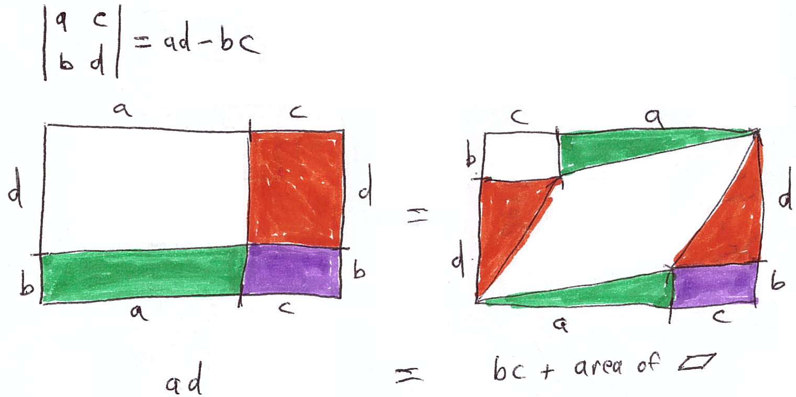

# Determinants of Matrices: Continuous and Discrete Interpretations

## Definitions

### Matrix

- Matrix: rectangular array of numbers $a_{ij}$
  - Matrix usually written as capital ($A$), its elements as lowercase with subscripts ($a_{ij}$)
- Multiple use cases: [linear transformations](/math-talks/2d-vectors-and-geometry/), [evaluating choices](/math-talks/himcm-scoring-models/), [describing a graph](/math-talks/duality-determinants/), etc.

### Permutation

- A permutation $\tau$ of $n$ elements is a function that maps values from $\\\{1\leq x \leq n \mid x\in\mathbb{Z}\\\}$ to the same set
- Mappings of a permutation is bijective (one-to-one), or each integer between $1$ and $n$ is mapped to a distinct integer between $1$ and $n$ by $\tau$
- The set of all permutations of $n$ elements is the symmetric group $S_n$, which has $n!$ elements

#### Cycle notation

- Permutations can be described by how they "cycle" elements
- E.g. define permutation $\tau\in S_5$ as $\tau=(123)(45)$:
  - The first "cycle" says that $\tau(1)=2$, $\tau(2)=3$, $\tau(3)=1$
  - The second "cycle" says that $\tau(4)=5$, $\tau(5)=4$

#### Sign of a permutation

- $\mathrm{sgn}(\tau)$ is $+1$ if it contains a single cycle of odd length, and $-1$ if it contains a single cycle of even length
- If $\tau$ contains multiple cycles, then $\mathrm{sgn}(\tau)$ is the product of the sign of all its cycles
- \*A property of $\mathrm{sgn}$ is that swapping any 2 elements of $\tau$ multiplies its sign by $-1$
- Similar to "parity" (e.g. in Rubik's cube and other puzzle games)

### Determinant (行列式)

$$\det(A) = \sum_{\tau\in S_n}\mathrm{sgn}(\tau)\cdot\prod_{i=1}^na_{i\tau(i)}$$

#### Equivalent formulas

- For a 2D matrix: $$\begin{vmatrix}a & b \\ c & d\end{vmatrix} = ad - bc$$
- For 3D matrix: Add all `\` diagonal products, subtract all `/` diagonal products (diagonals warp)
  - For $$\begin{pmatrix}a & b & c \\ d & e & f \\ g & h & i\end{pmatrix}$$
    , `\` diagonals are $aei$, $cdh$, and $bfg$, `/` diagonals are $ceg$, $bdi$, and $afh$
- Higher dimensional matrices: calculate recursively
  - $$
        \begin{vmatrix}
            a & b & c & d\\
            e & f & g & h\\
            i & j & k & l\\
            m & n & o & p
        \end{vmatrix}=a\cdot\begin{vmatrix}
            f & g & h\\
            j & k & l\\
            n & o & p
        \end{vmatrix}-b\cdot\begin{vmatrix}
            e & g & h\\
            i & k & l\\
            m & o & p
        \end{vmatrix}+c\cdot\begin{vmatrix}
            e & f & h\\
            i & j & l\\
            m & n & p
        \end{vmatrix}-d\cdot\begin{vmatrix}
            e & f & g\\
            i & j & k\\
            m & n & o
        \end{vmatrix}
    $$

## The geometric view: area/volume/mass

- 

## The discrete view: counting spanning trees of a graph (Kirchhoff's theorem)

- Intuitive plan: list all subgraphs with 5 edges, delete those with cycles

### Counting directed graphs (digraphs)

#### Avoiding undirected cycles

- Undirected cycles: `A -> B -> C`, `A -> D -> C`
- All undirected cycles have a vertex with $2$ arrows pointing at it
- Can counting these cycles be avoided by only counting cycles where all vertices have $0$ or $1$ arrows to it?

#### Euler's formula

- $V - E + F = 2$
- For trees: $F = 1$, so $V = E + 1$
- $V$ vertices, $V - 1$ arrows

- \*Given a tree and a root vertex, there exists exactly one directed tree, where there is exactly one directed path from the root vertex to any vertex
- In a directed tree, the root has $0$ arrows to it, and all other vertices have $1$ arrow to it
- Choose any vertex on the graph, each spanning tree corresponds to exactly one digraph satisfying:
  - One of the vertices have $0$ arrows pointing at it
  - All other vertices have exactly $1$ arrow pointing at it
  - No directed cycles

### Inclusion-exclusion principle

- Count all digraphs with one vertex with $0$ arrows and all other vertices with $1$ arrow
  - Pick $n-1$ of $n$ vertices, multiply their degrees
- For each directed cycle, subtract the number of such digraphs with that cycle
- For each pair of $2$ directed cycles, add back the number of such digraphs with these $2$ cycles
- For each pair of $3$ directed cycles, subtract the number of such digraphs with these $3$ cycles
- ...
- General form: odd number of cycles are subtracted, even number of cycles are added

### Laplacian matrix

- $a_{xx}$: how many edges are connected to vertex $x$ (or the _degree_ of vertex $x$)
- $a_{xy}\ (x\neq y)$: whether vertex $x$ is directly connected to vertex $y$. $-1$ if true, $0$ if false

## Summary: what is the determinant

- A function that maps a matrix to a single number that "captures" all its intrinsic properties
- The properties of a matrix doesn't change from swapping rows or columns, so the function should give the same expression after swapping rows or columns
  - Probably something that sums over permutations
- It's intuitive for an $n\times n$ matrix's determinant to be of degree $n$
  - $\sum_{\tau\in S_n}\prod a_{i\tau(i)}$ (permanent (积和式) of matrix)
- Maybe swapping 2 rows/columns of the matrix should negate the result?
  - Try $\det(A) = \sum_{\tau\in S_n}\mathrm{sgn}(\tau)\cdot\prod_{i=1}^na_{i\tau(i)}$ which is the determinant
