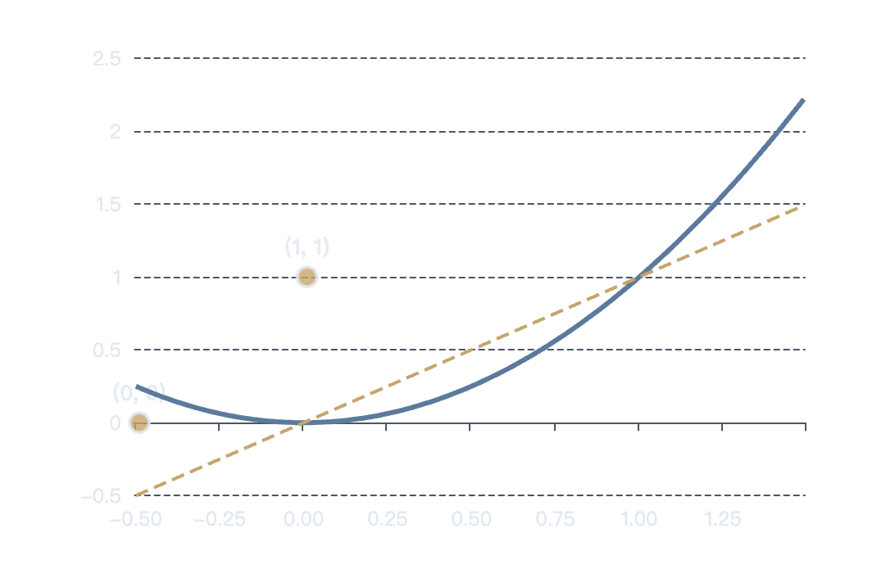
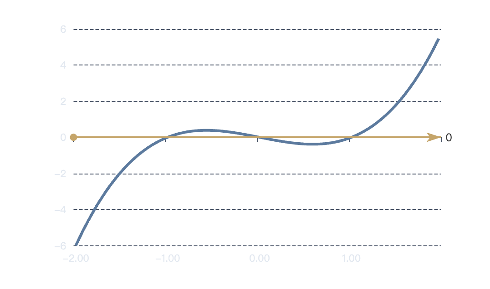
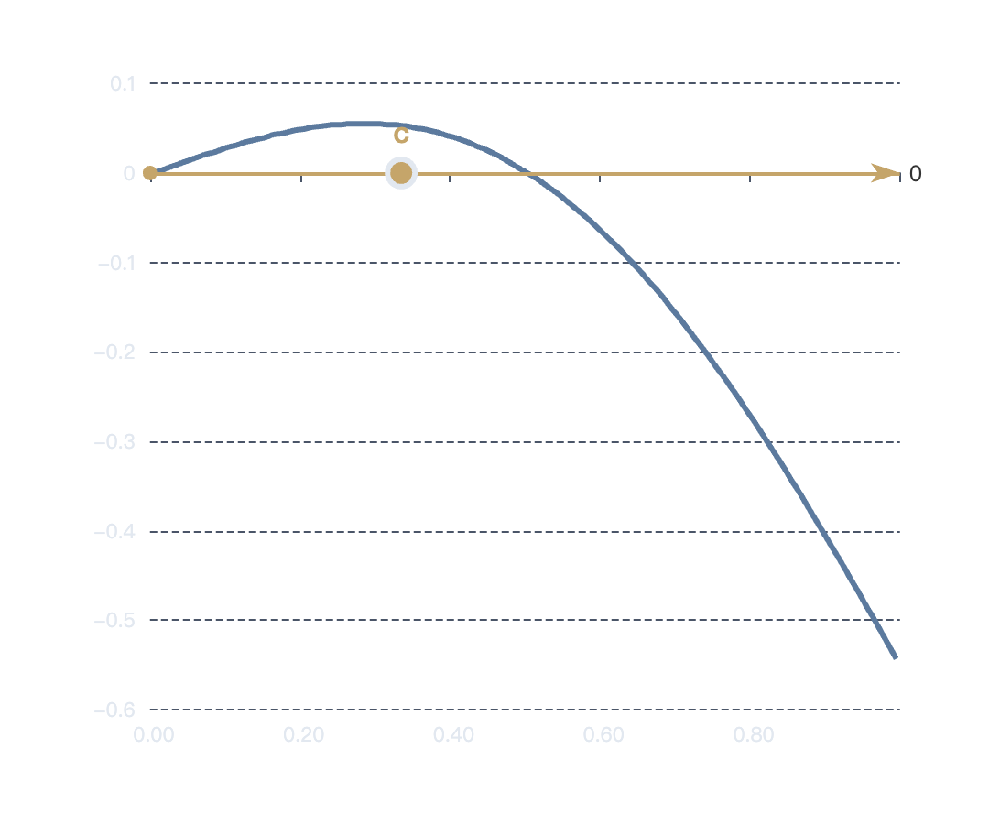
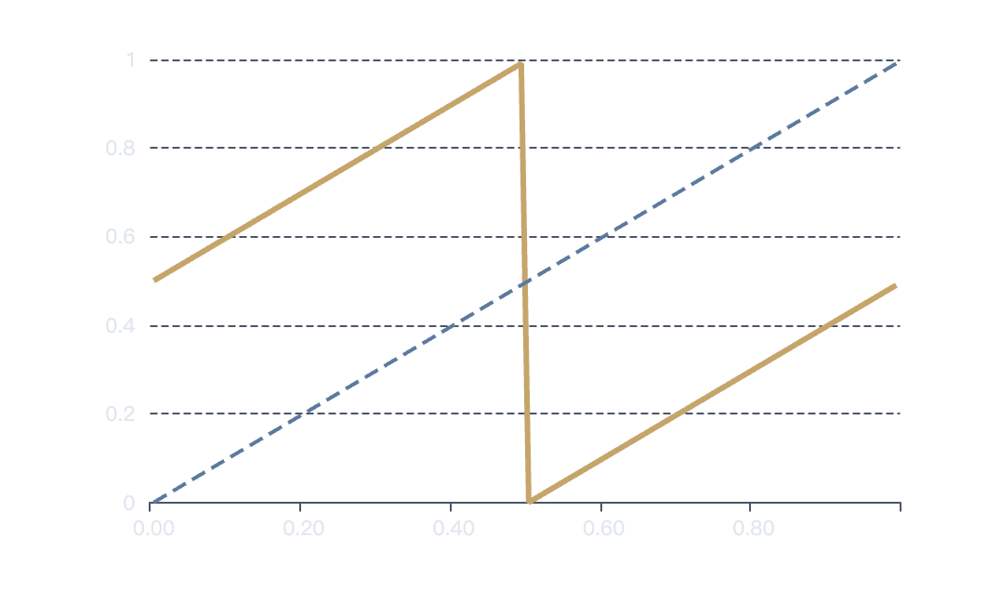
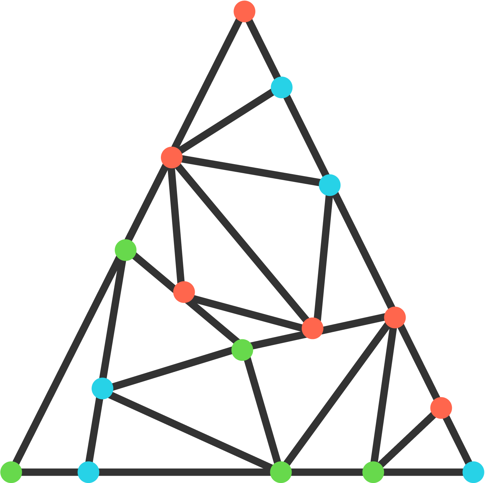
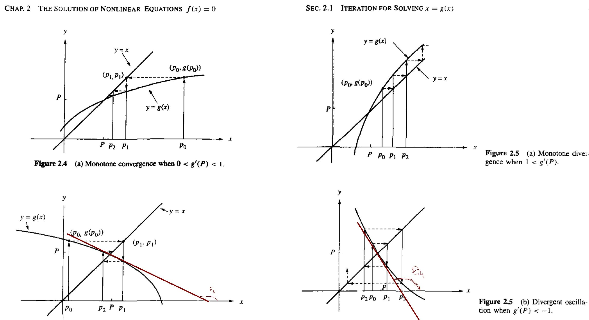
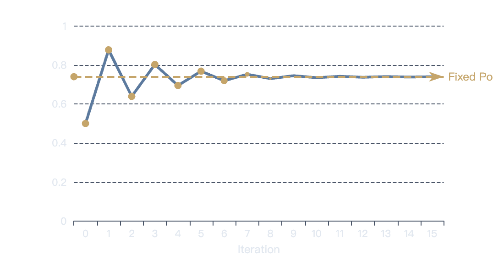

# Fixed Point Theorem: Why Must Something Stay Unchanged?

Mathematical Analysis • Mathematical Foundations • Analysis & Applications

---

## Building Intuition: The Crumpled Map Problem

A thought experiment that reveals a profound mathematical truth.

### Imagine This Scenario

You take a map, **crumple it up**, and place it back on the table. The map is now folded, wrinkled, and distorted in countless ways.

### The Central Question

Is there a point on the map that remains in the **exact same location** as before?

### Mathematical Insight

- **Intuition says:** Probably not — everything moved!
- **Mathematics says:** Absolutely **YES**!

There must exist at least one point that hasn't moved.

---

## Formal Definition: What is a Fixed Point?

### The Mathematical Definition

A point $x$ is called a **Fixed Point** if it satisfies: $f(x) = x$

In other words: The point remains completely unchanged when the function $f$ is applied to it.

- **Input equals Output**
- **An "Anchor" Point**
- **Invariant Under $f$**

---

## Concrete Example: $f(x) = x^2$

Let's find the fixed points of a basic quadratic function.

### Step-by-Step Solution

1. **Set up the equation:** $f(x) = x$ $x^2 = x$
2. **Rearrange:** $x^2 - x = 0$
3. **Factor:** $x(x - 1) = 0$
4. **Solution:** $x = 0$ or $x = 1$

### Graphical Visualization

{: width="75%"}

**Key Insight:** Fixed points occur where the curve $y = x^2$ intersects the line $y = x$ (shown in gold).

---

## The Challenge: The Key Question

### What if the function is more complicated?

- **Simple Cases:** For $f(x) = x^2$, we can solve algebraically. But what about functions without closed-form solutions?
- **The Real Challenge:** Can we still **guarantee** that a fixed point exists, even when we can't find it explicitly?

**We need a general theorem — not just examples!** (Existence Proof • General Guarantee • Universal Result)

---

## Foundation: Review: Intermediate Value Theorem (IVT)

A powerful tool from calculus that we'll use as our foundation.

### The IVT Statement

If $f$ is **continuous** on $[a, b]$ and $f(a) \cdot f(b) < 0$ then there exists $c \in (a, b)$ such that $f(c) = 0$

**Core Insight:** A sign change guarantees crossing zero.

### Visual Intuition

{: width="75%"}

- Continuous curve from negative to positive.
- Must cross the $x$-axis somewhere.

---

## Strategy: Reformulating the Problem

The crucial transformation that connects fixed points to IVT.

### The Key Transformation

- **Original Problem:** $f(x) = x$
- **Reformulated:** $f(x) - x = 0$

### Why This Works

Finding where $f(x) = x$ is equivalent to finding where $f(x) - x = 0$. This transforms a fixed point problem into a **root-finding problem**!

### The Connection

Now we can apply IVT! If we can show that $f(x) - x$ changes sign, a root (and thus a fixed point) must exist.

---

## Construction: Constructing a New Function

Define the auxiliary function: $g(x) = f(x) - x$

- **$g(x)$ Definition:** A new function that measures the **difference** between $f(x)$ and $x$.
- **Root of $g(x)$:** If $g(c) = 0$, then $f(c) = c$.
- **Fixed Point Found!** Finding a root of $g$ is equivalent to finding a fixed point of $f$.

**Key Insight:** We've transformed the problem from "find where $f(x) = x$" to "find where $g(x) = 0$" — a classic root-finding problem solvable with IVT!

---

## Conditions: Applying the Conditions

Setting up the boundary conditions for IVT.

### Our Assumptions

1. **Assumption 1:** $f(0) \geq 0$ (The function at 0 is non-negative)
2. **Assumption 2:** $f(1) \leq 1$ (The function at 1 doesn't exceed 1)

_Note: These are natural conditions for functions mapping $[0,1]$ into itself._

### What This Means for $g(x)$

- At $x = 0$: $g(0) = f(0) - 0 = f(0) \geq 0$
- At $x = 1$: $g(1) = f(1) - 1 \leq 0$ (since $f(1) \leq 1$)

**$g(x)$ changes sign from $\geq 0$ to $\leq 0$!**

---

## Application: Applying IVT to $g(x)$

### By the Intermediate Value Theorem

**Conditions Met:**

- $g$ is continuous ($f$ is continuous)
- $g(0) \geq 0$
- $g(1) \leq 0$

**IVT Conclusion:** Therefore, there exists some point $c \in (0, 1)$ such that: $g(c) = 0$

We've proven that $g(c) = 0$ for some $c$ in $(0,1)$. But what does this mean for $f$?

---

## Conclusion: Fixed Point Exists!

The final step that completes the proof.

### The Final Deduction

We know: $g(c) = 0$

By definition of $g$: $f(c) - c = 0$

Therefore: $f(c) = c$

### Visual Proof

{: width="75%"}

**A FIXED POINT EXISTS!** The point $c$ where $g(c) = 0$ is exactly where $f(c) = c$.

---

## Interactive Example: $f(x) = \cos(x)$

Does the cosine function have a fixed point?

- **Does $f(x) = \cos(x)$ have a fixed point?** **Yes!**
- **Reasoning:**
  1. **Continuity:** $\cos(x)$ is continuous everywhere.
  2. **Interval $[0, 1]$:** $\cos(0) = 1 \geq 0$, $\cos(1) \approx 0.54 \leq 1$.
  3. **Apply Theorem:** All conditions satisfied!

**Fixed point exists in $[0, 1]$!**

---

## Interactive Example: $f(x) = 2x$

A case where conditions matter!

- **Does $f(x) = 2x$ have a fixed point in $(0,1)$?** **No!**
- **Answer:** Only $x = 0$ is a fixed point, but it's not in $(0,1)$.
- **Why Theorem Doesn't Apply:**
  - $f(0) = 0$ (satisfies $f(0) \geq 0$)
  - $f(1) = 2$ (**violates** $f(1) \leq 1$)
- **The function maps $[0,1]$ outside itself!** At $x = 1$, $f(1) = 2$, which is outside the interval.

**The conditions are crucial!**

---

## Critical Insight: Continuity is Crucial

Without continuity, the guarantee disappears.

### Why Continuity Matters

If $f$ is **not continuous**, it can "jump" over the fixed point without ever hitting it.

### Counterexample:

$f(x) = x + 0.5$ for $x < 0.5$ $f(x) = x - 0.5$ for $x \geq 0.5$ This function has **no fixed point** because of the discontinuity at $x = 0.5$.

### Visual Explanation

{: width="75%"}

- **Continuous function:** must cross $y = x$.
- **Discontinuous:** can jump over the line.

---

## Extension: Brouwer Fixed Point Theorem

From 1D to 2D: A profound generalization.

### The 2D Version

- **The Setup:** Consider a **closed disk** (or any convex, compact set) in 2D. Let $f$ be a **continuous function** that maps the disk into itself.
- **The Theorem:** Brouwer's Theorem states: $\exists p \text{ such that } f(p) = p$ At least one fixed point **must exist!**

**Significance:** This extends to any finite dimension! It's one of the most important theorems in topology.

---

## Visualization: 2D Visualization: The Disk Transformation

Any continuous transformation of a disk into itself has a fixed point.

### The Crumpled Map Analogy (2D)

Imagine taking a **circular disk**, crumpling it, stretching it, twisting it, and placing it back on top of itself.

**The Question:** Is there a point that remains in exactly the same position? **Answer: YES!** Brouwer guarantees it.

### Visual Intuition

{: width="50%"}

No matter how you transform the disk, at least one point must stay fixed.

---

## Philosophy: The Beautiful Intuition

### The Elegant Insight

> "You cannot 'move everything' without leaving at least one point unchanged."

- **Counterintuitive:** It seems like you should be able to move everything, but mathematics says otherwise.
- **Universal:** This applies to ANY continuous transformation, no matter how complex.
- **Profound:** This simple idea has applications across mathematics, economics, and physics.

---

## Application: Fixed Point Iteration

A practical numerical method for solving equations.

### The Iteration Method

**THE RECURRENCE** $x_{n+1} = f(x_n)$

- **How it works:** Start with an initial guess $x_0$, then repeatedly apply $f$. If the sequence converges, it converges to a fixed point!
- **Visual:** The "staircase" or "cobweb" diagram shows how iteration converges to the fixed point where $y = f(x)$ intersects $y = x$.

{: width="75%"}

This turns equation-solving into simple iteration!

---

## Worked Example: Solving $x = \cos(x)$

Using iteration to find the fixed point.

### The Iteration Process

- **Initial Value:** $x_0 = 0.5$
- **Iteration Formula:** $x_{n+1} = \cos(x_n)$
- **First few iterations:**
  - $x_1 = \cos(0.5) \approx 0.8776$
  - $x_2 = \cos(0.8776) \approx 0.6390$
  - $x_3 = \cos(0.6390) \approx 0.8027$
  - $x_4 = \cos(0.8027) \approx 0.6948$

### Convergence Visualization

{: width="75%"}

**Converges to $x \approx 0.7391$** This is the unique fixed point of $\cos(x)$!

---

## Theory: Why Iteration Works

### Convergence Conditions

- **When It Works:** Iteration converges to a fixed point under certain conditions: $\vert f'(x)\vert < 1$ near the fixed point
- **The Intuition:** If the function is "flat enough" near the fixed point, each iteration gets closer:
  - Small derivative = small steps
  - Sequence approaches fixed point

**Practical Value:** Fixed point iteration provides a simple, robust numerical method for solving equations that might be difficult to solve algebraically.

---

## Profound Application: Game Theory & Nash Equilibrium

Where fixed point theorems changed economics forever.

### The Nash Equilibrium

- **Definition:** A set of strategies where no player can benefit by changing their strategy unilaterally.
- **John Nash's Proof (1950):** Nash used **Brouwer's Fixed Point Theorem** to prove that **every finite game has at least one equilibrium!**
- **Nobel Prize in Economics (1994)**
- **Example:** Prisoner's Dilemma — both players confessing is the Nash Equilibrium, even though both would be better off cooperating.

Fixed point theorems provide the mathematical foundation for modern game theory!

---

## Summary: Final Summary

### Key Takeaways

1. **Core Idea: Continuity $\Rightarrow$ Existence** A continuous function mapping $[0,1]$ into itself **must** have a fixed point.
2. **The Strategy: Transform problem $\rightarrow$ Apply IVT** Rewrite $f(x) = x$ as $g(x) = f(x) - x = 0$, then use the Intermediate Value Theorem.
3. **Generalization: Brouwer's Theorem** Extends to any dimension: Any continuous transformation of a disk into itself has a fixed point.
4. **Applications: Wide-ranging impact** From numerical methods (fixed point iteration) to economics (Nash Equilibrium).

**In a changing world, something always stays the same.**
